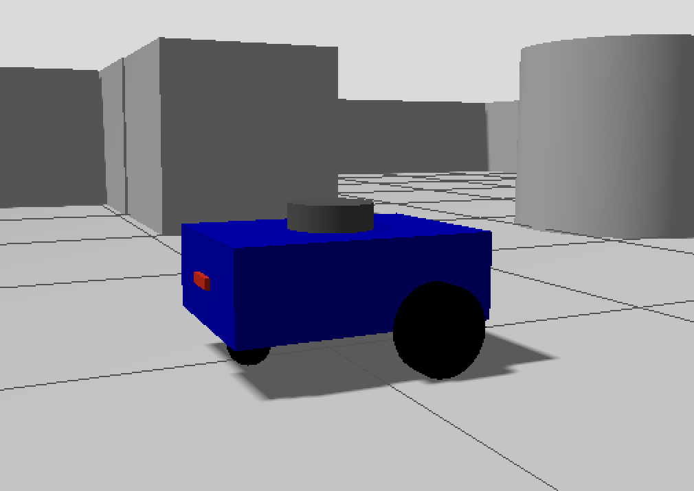
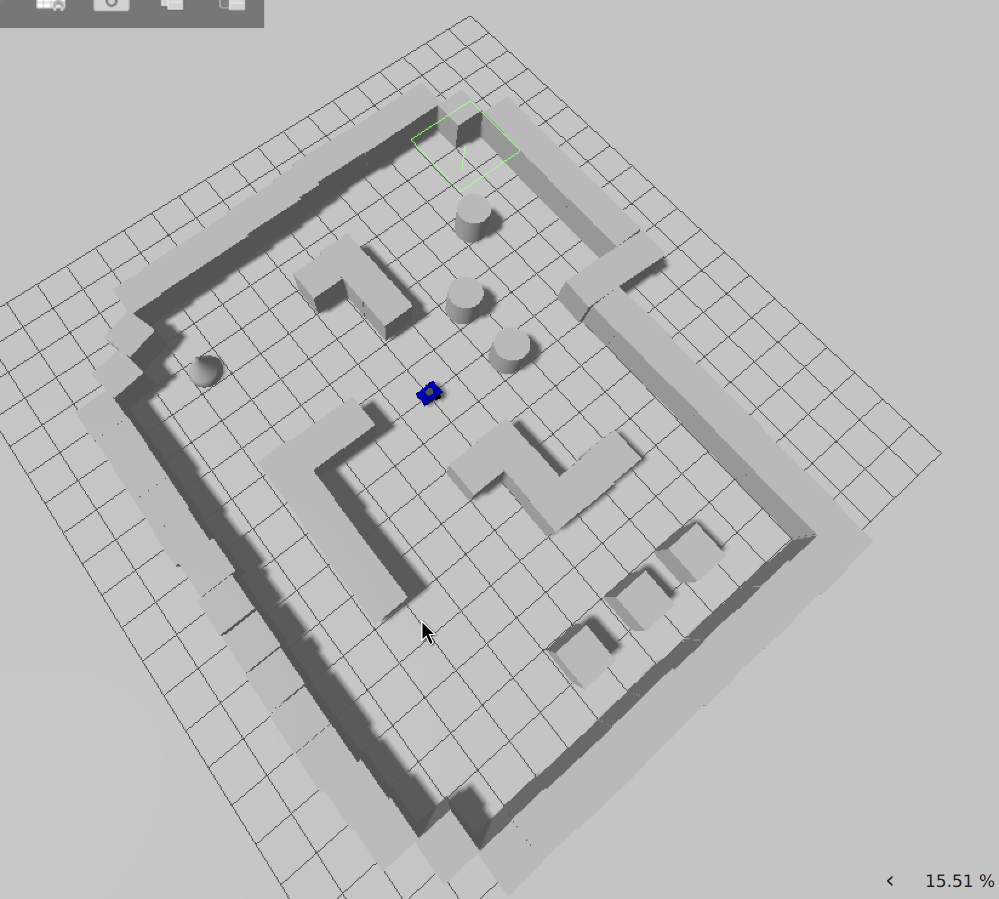
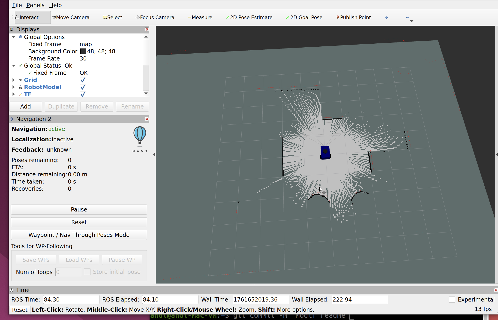
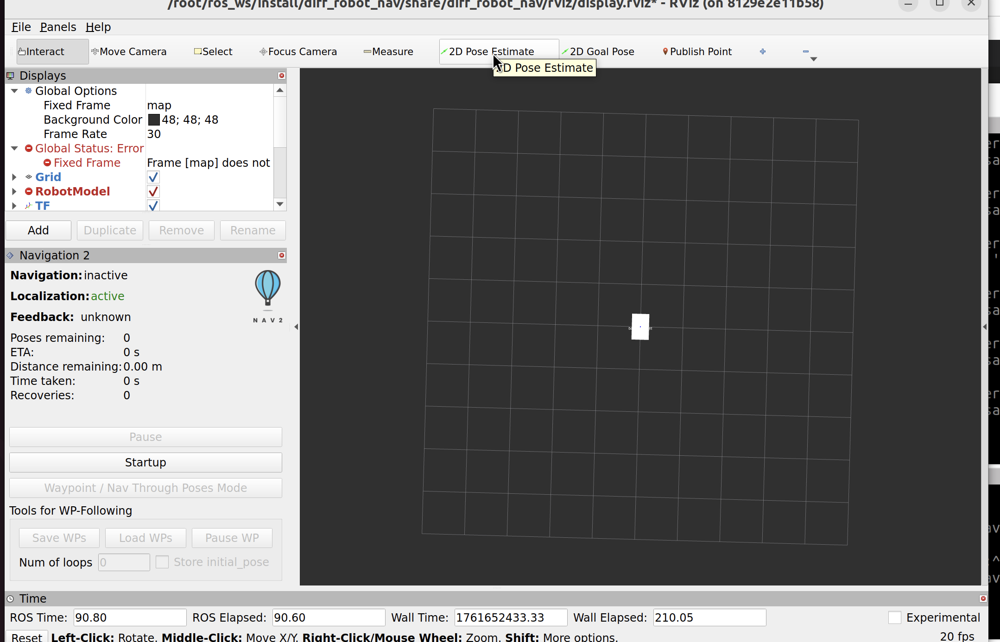
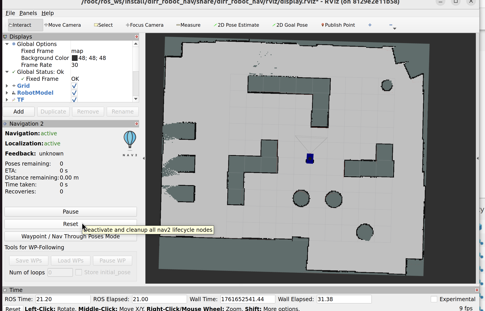
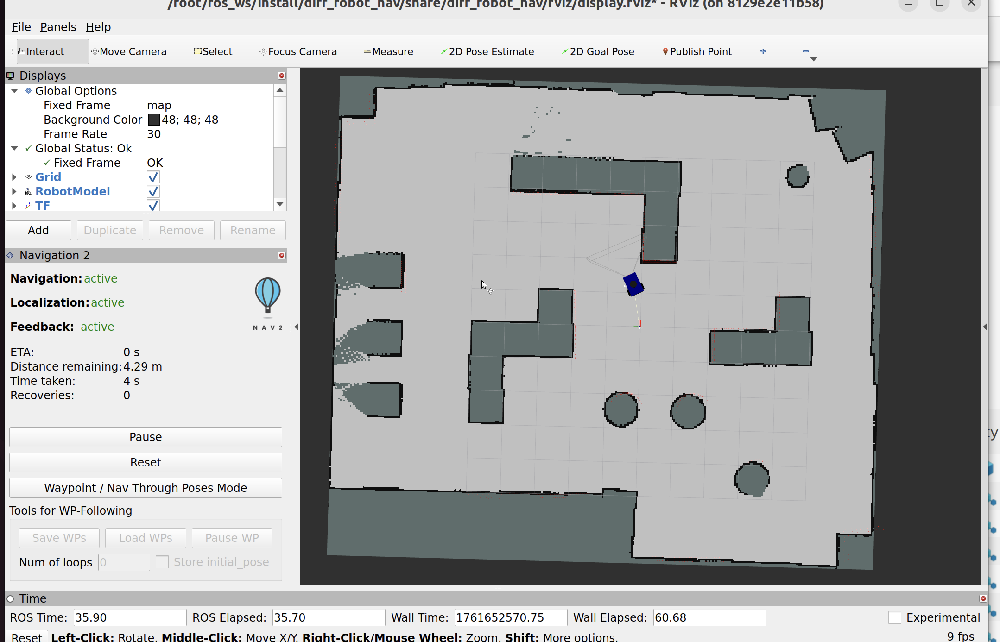

# DiffRobot-ROS2-Navigation

A full **ROS 2-based differential drive robot** project for **simulation, localization, mapping, and autonomous navigation**, entirely containerized with **Docker Compose**.  

This repository demonstrates a complete robotics pipeline — from URDF description and ROS2 control to SLAM and navigation — all reproducible and modular.

---

## 🧭 Table of Contents

1. [Project Overview](#1️⃣-project-overview)  
2. [Requirements](#2️⃣-requirements)
3. [Docker Setup](#3️⃣-docker-setup)  
4. [Running the Simulation](#4️⃣-running-the-simulation)  
5. [Localization, Mapping & Navigation](#5️⃣-localization-mapping--navigation)  
6. [Common Issues](#6️⃣-common-issues)

---

## 1️⃣ Project Overview

The **DiffRobot-ROS2-Navigation** project is a modular ROS 2 workspace that includes:

| Package | Purpose |
|----------|----------|
| 🛠️ **diff_robot_controllers** | Implements **ros2_control** for differential drive movement and velocity control. |
| 🧱 **diff_robot_description** | Defines the robot in **URDF/Xacro**, including sensors, joints, and geometry. |
| 🛰️ **diff_robot_localization** | Uses **robot_localization (EKF)** for state estimation by fusing IMU and odometry. |
| 🗺️ **diff_robot_nav** | Provides **SLAM** and **Nav2** configuration for mapping and path planning. |
| 🎮 **diff_robot_simulation** | Sets up **Gazebo worlds** and plugins for simulation and testing. |

Everything runs inside a Docker container for an easy, dependency-free setup.

## 2️⃣ Requirements

- Docker

Without docker container, you need:

- ROS 2 Jazzy
- Ubuntu 24.04 (recommended)
- X11 display support for GUI tools (RViz, Gazebo)
- Gazebo Harmonic

---

## 3️⃣ Docker Setup

### 🐳 docker-compose.yml

The Volume has to be changed according to the workspace path **device: path/to/ws**
```yaml
version: "3.9"
services:
  ros2-control-1:
    build:
      context: .
      dockerfile: Dockerfile
    command: /bin/bash
    environment:
      - DISPLAY=$DISPLAY
      - QT_X11_NO_MITSHM=1
    image: ros2-control-image:1.0
    container_name: ros2-control-container
    restart: unless-stopped
    volumes:
      - ws-volume:/root/ros_ws
      - /tmp/.X11-unix:/tmp/.X11-unix
    ports:
      - "15001:11313"
    tty: true
    stdin_open: true

volumes:
  ws-volume:
    driver: local
    driver_opts:
      type: none
      device: /home/andi/DockerDev/diff_robot/dev_ws
      o: bind
```

### Setup Commands

1️⃣ Build the Docker image

```bash
docker-compose build
```

2️⃣ Start the container

```bash
xhost +local:root   # Allow GUI for Gazebo/RViz
docker-compose up -d
```

3️⃣ Access the running container

```bash
docker exec -it ros2-control-container bash
```

4️⃣ Build and source your ROS 2 workspace

```bash
cd ~/ros_ws
colcon build
source install/setup.bash
```

Now your environment is ready to launch the simulation, localization, and navigation stacks.

---

## 4️⃣ Running the Simulation
3.1 Launch Gazebo Simulation

To visualize the differential drive robot model in a simulated world (default custom maze world from diff_robot_simulation/worlds/maze.sdf):

```bash
ros2 launch diff_robot_simulation gazebo.launch.py
```

Example: Differential drive robot in Gazebo.



Example: Maze world in Gazebo.



3.2 Run the Controllers

Load the ros2_control controllers for the differential drive robot:

```bash
ros2 launch diff_robot_controllers gz_controllers.launch.py
```

This will automatically lunch RViz2 as well. You can control this with the launch argument:

```bash
ros2 launch diff_robot_controllers gz_controllers.launch.py launch_rviz:=false
```

You can verify available controllers:

```bash
ros2 control list_controllers
```

🎮 3.3 Teleoperate the Robot (Optional)

Install teleop if not already included:

```bash
sudo apt install ros-humble-teleop-twist-keyboard
```

Then run the teleop by remapping the /cmd_vel topic to /diff_drive_controller/cmd_vel one and ensuring the message is stamped:

```bash
ros2 run teleop_twist_keyboard teleop_twist_keyboard  --ros-args -r /cmd_vel:=/diff_drive_controller/cmd_vel -p stamped:=true
```

Use your keyboard to move the robot inside Gazebo.

---

## 5️⃣ Localization, Mapping & Navigation

This section explains the main stages of making your robot autonomous:
Localization → Mapping → Navigation.

4.1 Localization (EKF)

Run the Extended Kalman Filter to fuse odometry and IMU:

```bash
ros2 launch diff_robot_localization ekf.launch.py
```

This improves pose accuracy and stability by filtering noisy data.

4.2 Mapping (SLAM)

To build a map of the environment, launch the RViz2 and Gazebo simulation with:

```bash
ros2 launch diff_robot_nav diff_robot_slam.launch.py
```

Then, drive the robot via teleop to explore the environment.

When you’re done mapping, save the map useing the slam_toolbox pkg service:

```bash
ros2 service call /slam_toolbox/save_map slam_toolbox/srv/SaveMap "name: data: '/path/to/maps_folder/map_name'"
```

Example: Real-time SLAM map generation in RViz..



4.3 Autonomous Navigation (Nav2)

Once a map is available, start Nav2 for autonomous navigation by taking care of modifying the map path in the launch file or by using the map launch argument:

```bash
ros2 launch diff_robot_nav diff_robot_navigation.launch.py map:=/path/to/map/to/load
```

Then open RViz, set the initial pose with SetInitialPose, reset the nav2 components on the left tab and click 2D Goal Pose to send a target.

Example: Set the initial pose.



Example: Reset the NAV2 components.



Example: Robot planning and navigating to a goal using Nav2.



---

## 6️⃣ Common Issues

| Issue | Description | Fix |
|-------|--------------|-----|
| **GUI not showing** | X11 permission error | Run `xhost +local:root` before `docker-compose up` |
| **controller_manager not running** | Missing `ros2_control` startup | Start controller manually or check launch file |
| **Slow simulation** | CPU overload | Use smaller Gazebo world or enable GPU rendering |
| **No navigation** | Localization not running | Ensure EKF and map topics are publishing correctly |